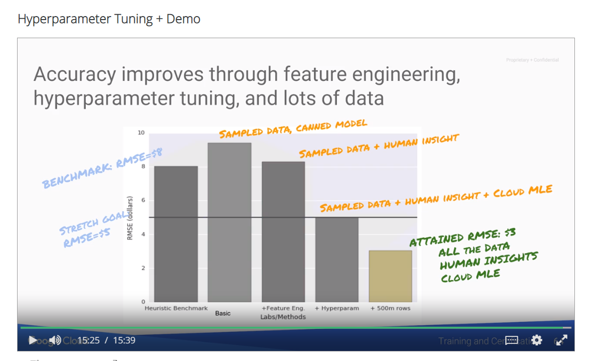

# What is Machine Learning ?

- Supervised learning
  - Regression ((R)MSE: (root) mean squared error)
  - Classification (Cross entropy: to optimize classification models) & (Confusion matrix: to describe the performance of classification models)
- Unsupervised learning

- Feature engineering
- Accuracy
- Precision(Accuracy when classifier says 'yes') & Recall(Accuracy when the truth is 'yes'), important especially with unbalanced datasets
- Precision => when the thing we are trying to find is very common
- Recall => when the thing we are trying to find is very rare
- Regression

### What makes a good dataset

- Must cover all the cases (purposefully search for the data)
- Negative examples and near-misses
- Explore the data you have, fix problems, don't throw away outliers right away, see if you can give an explanation

#### Launch cloud datalab

```bash
datalab create dataengvm --zone us-central1-a
```

#### New notebook

```bash
%bash
git clone https://github.com/GoogleCloudPlatform/training-data-analyst
cd training-data-analyst
```

```python
from google.cloud import bigquery
import seaborn as sns
import matplotlib.pyplot as plt
import pandas as pd
import numpy as np
import shutil
```

```bash
%%javascript
$.getScript('https://kmahelona.github.io/ipython_notebook_goodies/ipython_notebook_toc.js')
```

```python
sql = """
  SELECT
    pickup_datetime,
    pickup_longitude, pickup_latitude,
    dropoff_longitude, dropoff_latitude,
    passenger_count,
    trip_distance,
    tolls_amount,
    fare_amount,
    total_amount
  FROM `nyc-tlc.yellow.trips`
  LIMIT 10
"""
```

```python
client = bigquery.Client()
trips = client.query(sql).to_dataframe()
trips
```

```python
sql = """
  SELECT
    pickup_datetime,
    pickup_longitude, pickup_latitude,
    dropoff_longitude, dropoff_latitude,
    passenger_count,
    trip_distance,
    tolls_amount,
    fare_amount,
    total_amount
  FROM
    `nyc-tlc.yellow.trips`
  WHERE
    MOD(ABS(FARM_FINGERPRINT(CAST(pickup_datetime AS STRING))), 100000) = 1
"""
```

```python
trips = client.query(sql).to_dataframe()
trips[:10]
```

#### Exploring the data

```python
ax = sns.regplot(x="trip_distance", y="fare_amount", fit_reg=False, ci=None, truncate=True, data=trips)
ax.figure.set_size_inches(10, 8)
```

#### Keep only trips longer than zero miles and fare amounts that are at least the minimum cab fare (\$2.50).

```python
sql = """
  SELECT
    pickup_datetime,
    pickup_longitude, pickup_latitude,
    dropoff_longitude, dropoff_latitude,
    passenger_count,
    trip_distance,
    tolls_amount,
    fare_amount,
    total_amount
  FROM
    `nyc-tlc.yellow.trips`
  WHERE
    MOD(ABS(FARM_FINGERPRINT(CAST(pickup_datetime AS STRING))), 100000) = 1
    AND trip_distance > 0 AND fare_amount >= 2.5
"""
```

```python
trips = client.query(sql).to_dataframe()
ax = sns.regplot(x="trip_distance", y="fare_amount", fit_reg=False, ci=None, truncate=True, data=trips)
ax.figure.set_size_inches(10, 8)
```

```python
tollrides = trips[trips['tolls_amount'] > 0]
tollrides[tollrides['pickup_datetime'] == pd.Timestamp('2010-04-29 12:28:00')]
```

#### Describe

```python
trips.describe()
```

#### Finally, let's actually look at the start and end of a few of the trips.

```python
def showrides(df, numlines):
  lats = []
  lons = []
  for iter, row in df[:numlines].iterrows():
    lons.append(row['pickup_longitude'])
    lons.append(row['dropoff_longitude'])
    lons.append(None)
    lats.append(row['pickup_latitude'])
    lats.append(row['dropoff_latitude'])
    lats.append(None)

  sns.set_style("darkgrid")
  plt.figure(figsize=(10,8))
  plt.plot(lons, lats)

showrides(trips, 10)
```

#### Quality control and other preprocessing

```python
def preprocess(trips_in):
  trips = trips_in.copy(deep=True)
  trips.fare_amount = trips.fare_amount + trips.tolls_amount
  del trips['tolls_amount']
  del trips['total_amount']
  del trips['trip_distance']
  del trips['pickup_datetime']
  qc = np.all([\
             trips['pickup_longitude'] > -78, \
             trips['pickup_longitude'] < -70, \
             trips['dropoff_longitude'] > -78, \
             trips['dropoff_longitude'] < -70, \
             trips['pickup_latitude'] > 37, \
             trips['pickup_latitude'] < 45, \
             trips['dropoff_latitude'] > 37, \
             trips['dropoff_latitude'] < 45, \
             trips['passenger_count'] > 0,
            ], axis=0)
  return trips[qc]

tripsqc = preprocess(trips)
tripsqc.describe()
```

#### Create ML datasets

```python
shuffled = tripsqc.sample(frac=1)
trainsize = int(len(shuffled['fare_amount']) * 0.70)
validsize = int(len(shuffled['fare_amount']) * 0.15)

df_train = shuffled.iloc[:trainsize, :]
df_valid = shuffled.iloc[trainsize:(trainsize+validsize), :]
df_test = shuffled.iloc[(trainsize+validsize):, :]
```

#### Write to csv files

```python
def to_csv(df, filename):
  outdf = df.copy(deep=False)
  outdf.loc[:, 'key'] = np.arange(0, len(outdf)) # rownumber as key
  # reorder columns so that target is first column
  cols = outdf.columns.tolist()
  cols.remove('fare_amount')
  cols.insert(0, 'fare_amount')
  print (cols)  # new order of columns
  outdf = outdf[cols]
  outdf.to_csv(filename, header=False, index_label=False, index=False)

to_csv(df_train, 'taxi-train.csv')
to_csv(df_valid, 'taxi-valid.csv')
to_csv(df_test, 'taxi-test.csv')
```

```python
!head -10 taxi-valid.csv
```

#### Verify csv files exist

```bash
!ls -l *.csv
```

```bash
%bash
head taxi-train.csv
```

#### Benchmark

The model is going to be to simply divide the mean fare_amount by the mean trip_distance to come up with a rate and use that to predict. Let's compute the RMSE of such a model.

```python
def distance_between(lat1, lon1, lat2, lon2):
  # haversine formula to compute distance "as the crow flies".  Taxis can't fly of course.
  dist = np.degrees(np.arccos(np.minimum(1,np.sin(np.radians(lat1)) * np.sin(np.radians(lat2)) + np.cos(np.radians(lat1)) * np.cos(np.radians(lat2)) * np.cos(np.radians(lon2 - lon1))))) * 60 * 1.515 * 1.609344
  return dist

def estimate_distance(df):
  return distance_between(df['pickuplat'], df['pickuplon'], df['dropofflat'], df['dropofflon'])

def compute_rmse(actual, predicted):
  return np.sqrt(np.mean((actual-predicted)**2))

def print_rmse(df, rate, name):
  print ("{1} RMSE = {0}".format(compute_rmse(df['fare_amount'], rate*estimate_distance(df)), name))

FEATURES = ['pickuplon','pickuplat','dropofflon','dropofflat','passengers']
TARGET = 'fare_amount'
columns = list([TARGET])
columns.extend(FEATURES) # in CSV, target is the first column, after the features
columns.append('key')
df_train = pd.read_csv('taxi-train.csv', header=None, names=columns)
df_valid = pd.read_csv('taxi-valid.csv', header=None, names=columns)
df_test = pd.read_csv('taxi-test.csv', header=None, names=columns)
rate = df_train['fare_amount'].mean() / estimate_distance(df_train).mean()
print ("Rate = ${0}/km".format(rate))
print_rmse(df_train, rate, 'Train')
print_rmse(df_valid, rate, 'Valid')
print_rmse(df_test, rate, 'Test')
```

#### The RMSE depends on the dataset, and for comparison, we have to evaluate on the same dataset each time. We'll use this query in later labs:

```python
def create_query(phase, EVERY_N):
  """
  phase: 1=train 2=valid
  """
  base_query = """
SELECT
  (tolls_amount + fare_amount) AS fare_amount,
  CONCAT(CAST(pickup_datetime AS STRING), CAST(pickup_longitude AS STRING), CAST(pickup_latitude AS STRING), CAST(dropoff_latitude AS STRING), CAST(dropoff_longitude AS STRING)) AS key,
  EXTRACT(DAYOFWEEK FROM pickup_datetime)*1.0 AS dayofweek,
  EXTRACT(HOUR FROM pickup_datetime)*1.0 AS hourofday,
  pickup_longitude AS pickuplon,
  pickup_latitude AS pickuplat,
  dropoff_longitude AS dropofflon,
  dropoff_latitude AS dropofflat,
  passenger_count*1.0 AS passengers
FROM
  `nyc-tlc.yellow.trips`
WHERE
  trip_distance > 0
  AND fare_amount >= 2.5
  AND pickup_longitude > -78
  AND pickup_longitude < -70
  AND dropoff_longitude > -78
  AND dropoff_longitude < -70
  AND pickup_latitude > 37
  AND pickup_latitude < 45
  AND dropoff_latitude > 37
  AND dropoff_latitude < 45
  AND passenger_count > 0
  """

  if EVERY_N == None:
    if phase < 2:
      # training
      query = "{0} AND MOD(ABS(FARM_FINGERPRINT(CAST(pickup_datetime AS STRING))), 4) < 2".format(base_query)
    else:
      query = "{0} AND MOD(ABS(FARM_FINGERPRINT(CAST(pickup_datetime AS STRING))), 4) = {1}".format(base_query, phase)
  else:
      query = "{0} AND MOD(ABS(FARM_FINGERPRINT(CAST(pickup_datetime AS STRING))), {1}) = {2}".format(base_query, EVERY_N, phase)

  return query

query = create_query(2, 100000)
df_valid = client.query(query).to_dataframe()
print_rmse(df_valid, 2.56, 'Final Validation Set')
```

#### What we just did:

- Explore
- Create datasets (training data, validation data, test data)
- Benchmark

## Tensorflow

- Create the graph
- Run the graph

Minimizes the tensorflow C++ context switches for efficient computation

### Getting started with Tensorflow

```bash
%bash
git clone https://github.com/GoogleCloudPlatform/training-data-analyst
cd training-data-analyst
```

```python
import tensorflow as tf
import numpy as np

print(tf.__version__)
```

#### Ading two tensors

- Numpy

```python
a = np.array([5, 3, 8])
b = np.array([3, -1, 2])
c = np.add(a, b)
print(c)
```

- Graphs with Tensorflow

```python
a = tf.constant([5, 3, 8])
b = tf.constant([3, -1, 2])
c = tf.add(a, b)
print(c)
```

#### Run the graph

```python
with tf.Session() as sess:
  result = sess.run(c)
  print(result)
```

#### Using feed_dict

```python
a = tf.placeholder(dtype=tf.int32, shape=(None,))  # batchsize x scalar
b = tf.placeholder(dtype=tf.int32, shape=(None,))
c = tf.add(a, b)
with tf.Session() as sess:
  result = sess.run(c, feed_dict={
      a: [3, 4, 5],
      b: [-1, 2, 3]
    })
  print(result)
```

#### Heron formula in Tensorflow

The area of triangle whose three sides are $(a, b, c)$ is $\sqrt{s(s-a)(s-b)(s-c)}$ where $s=\frac{a+b+c}{2}$

```python
def compute_area(sides):
  # slice the input to get the sides
  a = sides[:,0]  # 5.0, 2.3
  b = sides[:,1]  # 3.0, 4.1
  c = sides[:,2]  # 7.1, 4.8

  # Heron's formula
  s = (a + b + c) * 0.5   # (a + b) is a short-cut to tf.add(a, b)
  areasq = s * (s - a) * (s - b) * (s - c) # (a * b) is a short-cut to tf.multiply(a, b), not tf.matmul(a, b)
  return tf.sqrt(areasq)

with tf.Session() as sess:
  # pass in two triangles
  area = compute_area(tf.constant([
      [5.0, 3.0, 7.1],
      [2.3, 4.1, 4.8]
    ]))
  result = sess.run(area)
  print(result)
```

#### Placeholder and feed_dict

```python
with tf.Session() as sess:
  sides = tf.placeholder(tf.float32, shape=(None, 3))  # batchsize number of triangles, 3 sides
  area = compute_area(sides)
  result = sess.run(area, feed_dict = {
      sides: [
        [5.0, 3.0, 7.1],
        [2.3, 4.1, 4.8]
      ]
    })
  print(result)
```

#### Eager mode evealuation

```python
import tensorflow as tf
from tensorflow.contrib.eager.python import tfe

tfe.enable_eager_execution()

def compute_area(sides):
  # slice the input to get the sides
  a = sides[:,0]  # 5.0, 2.3
  b = sides[:,1]  # 3.0, 4.1
  c = sides[:,2]  # 7.1, 4.8

  # Heron's formula
  s = (a + b + c) * 0.5   # (a + b) is a short-cut to tf.add(a, b)
  areasq = s * (s - a) * (s - b) * (s - c) # (a * b) is a short-cut to tf.multiply(a, b), not tf.matmul(a, b)
  return tf.sqrt(areasq)

area = compute_area(tf.constant([
      [5.0, 3.0, 7.1],
      [2.3, 4.1, 4.8]
    ]))

print(area)
```

### Tensorflow Estimator

```bash
%bash
git clone https://github.com/GoogleCloudPlatform/training-data-analyst
cd training-data-analyst
```

```python
import datalab.bigquery as bq
import tensorflow as tf
import pandas as pd
import numpy as np
import shutil

print(tf.__version__)
```

```python
# In CSV, label is the first column, after the features, followed by the key
CSV_COLUMNS = ['fare_amount', 'pickuplon','pickuplat','dropofflon','dropofflat','passengers', 'key']
FEATURES = CSV_COLUMNS[1:len(CSV_COLUMNS) - 1]
LABEL = CSV_COLUMNS[0]

df_train = pd.read_csv('./taxi-train.csv', header = None, names = CSV_COLUMNS)
df_valid = pd.read_csv('./taxi-valid.csv', header = None, names = CSV_COLUMNS)
```

#### Making input

```python
def make_input_fn(df, num_epochs):
  return tf.estimator.inputs.pandas_input_fn(
    x = df,
    y = df[LABEL],
    batch_size = 128,
    num_epochs = num_epochs,
    shuffle = True,
    queue_capacity = 1000,
    num_threads = 1
  )
```

#### Create feature columns for estimator

```python
def make_feature_cols():
  input_columns = [tf.feature_column.numeric_column(k) for k in FEATURES]
  return input_columns
```

#### Linear Regression with tf.Estimator framework

```python
tf.logging.set_verbosity(tf.logging.INFO)

OUTDIR = 'taxi_trained'
shutil.rmtree(OUTDIR, ignore_errors = True) # start fresh each time

model = tf.estimator.LinearRegressor(
      feature_columns = make_feature_cols(), model_dir = OUTDIR)

model.train(input_fn = make_input_fn(df_train, num_epochs = 10))
```

#### Evaluate on the validation data

```python
def print_rmse(model, name, df):
  metrics = model.evaluate(input_fn = make_input_fn(df, 1))
  print('RMSE on {} dataset = {}'.format(name, np.sqrt(metrics['average_loss'])))
print_rmse(model, 'validation', df_valid)
```

#### rmse = 9 worse than the benchmark 6. Let's use the model for prediction

```python
import itertools
# Read saved model and use it for prediction
model = tf.estimator.LinearRegressor(
      feature_columns = make_feature_cols(), model_dir = OUTDIR)
preds_iter = model.predict(input_fn = make_input_fn(df_valid, 1))
print([pred['predictions'][0] for pred in list(itertools.islice(preds_iter, 5))])
```

#### Same value for every trip. Let's try a more complex model (DNNRegressor)

```python
tf.logging.set_verbosity(tf.logging.INFO)
shutil.rmtree(OUTDIR, ignore_errors = True) # start fresh each time
model = tf.estimator.DNNRegressor(hidden_units = [32, 8, 2],
      feature_columns = make_feature_cols(), model_dir = OUTDIR)
model.train(input_fn = make_input_fn(df_train, num_epochs = 100));
print_rmse(model, 'validation', df_valid)
```

#### rmse=11, even worse

#### Let's do a benchmark on the test dataset, with our best model so far (LinearRegressor)

```python
import datalab.bigquery as bq
import numpy as np
import pandas as pd

def create_query(phase, EVERY_N):
  """
  phase: 1 = train 2 = valid
  """
  base_query = """
SELECT
  (tolls_amount + fare_amount) AS fare_amount,
  CONCAT(STRING(pickup_datetime), STRING(pickup_longitude), STRING(pickup_latitude), STRING(dropoff_latitude), STRING(dropoff_longitude)) AS key,
  DAYOFWEEK(pickup_datetime)*1.0 AS dayofweek,
  HOUR(pickup_datetime)*1.0 AS hourofday,
  pickup_longitude AS pickuplon,
  pickup_latitude AS pickuplat,
  dropoff_longitude AS dropofflon,
  dropoff_latitude AS dropofflat,
  passenger_count*1.0 AS passengers,
FROM
  [nyc-tlc:yellow.trips]
WHERE
  trip_distance > 0
  AND fare_amount >= 2.5
  AND pickup_longitude > -78
  AND pickup_longitude < -70
  AND dropoff_longitude > -78
  AND dropoff_longitude < -70
  AND pickup_latitude > 37
  AND pickup_latitude < 45
  AND dropoff_latitude > 37
  AND dropoff_latitude < 45
  AND passenger_count > 0
  """

  if EVERY_N == None:
    if phase < 2:
      # Training
      query = "{0} AND ABS(HASH(pickup_datetime)) % 4 < 2".format(base_query)
    else:
      # Validation
      query = "{0} AND ABS(HASH(pickup_datetime)) % 4 == {1}".format(base_query, phase)
  else:
    query = "{0} AND ABS(HASH(pickup_datetime)) % {1} == {2}".format(base_query, EVERY_N, phase)

  return query

query = create_query(2, 100000)
df = bq.Query(query).to_dataframe()
```

#### RMSE = 9.41, worse than the benchmark 6, and worse than our distance-based rule RMSE of 8.02

```python

```

### Ways to build effective models

- Big data (more data)
- Feature engineering
- Try different model architechtures

### Refactor to add batching and feature-creation

```python
import datalab.bigquery as bq
import tensorflow as tf
import numpy as np
import shutil
import tensorflow as tf
print(tf.__version__)
```

#### Refactor the input

DEFAULTS are useful for:

- Dealing with null fields
- Infering the columns types

```python
CSV_COLUMNS = ['fare_amount', 'pickuplon','pickuplat','dropofflon','dropofflat','passengers', 'key']
LABEL_COLUMN = 'fare_amount'
DEFAULTS = [[0.0], [-74.0], [40.0], [-74.0], [40.7], [1.0], ['nokey']]

def read_dataset(filename, mode, batch_size = 512):
  def _input_fn():
    def decode_csv(value_column):
      columns = tf.decode_csv(value_column, record_defaults = DEFAULTS)
      features = dict(zip(CSV_COLUMNS, columns))
      label = features.pop(LABEL_COLUMN)
      return features, label

    # Create list of files that match pattern
    file_list = tf.gfile.Glob(filename)

    # Create dataset from file list
    # TextLineDataset is used to read sharded data by giving it the filenames
    dataset = tf.data.TextLineDataset(file_list).map(decode_csv)
    if mode == tf.estimator.ModeKeys.TRAIN:
        num_epochs = None # indefinitely
        dataset = dataset.shuffle(buffer_size = 10 * batch_size)
    else:
        num_epochs = 1 # end-of-input after this

    dataset = dataset.repeat(num_epochs).batch(batch_size)
    return dataset.make_one_shot_iterator().get_next()
  return _input_fn


def get_train():
  return read_dataset('./taxi-train.csv', mode = tf.estimator.ModeKeys.TRAIN)

def get_valid():
  return read_dataset('./taxi-valid.csv', mode = tf.estimator.ModeKeys.EVAL)

def get_test():
  return read_dataset('./taxi-test.csv', mode = tf.estimator.ModeKeys.EVAL)
```

#### Refactor the way features are created

```python
INPUT_COLUMNS = [
    tf.feature_column.numeric_column('pickuplon'),
    tf.feature_column.numeric_column('pickuplat'),
    tf.feature_column.numeric_column('dropofflat'),
    tf.feature_column.numeric_column('dropofflon'),
    tf.feature_column.numeric_column('passengers'),
]

def add_more_features(feats):
  # Nothing to add (yet!)
  return feats

feature_cols = add_more_features(INPUT_COLUMNS)
```

#### Create and train the model

```python
tf.logging.set_verbosity(tf.logging.INFO)
OUTDIR = 'taxi_trained'
shutil.rmtree(OUTDIR, ignore_errors = True) # start fresh each time
model = tf.estimator.LinearRegressor(
      feature_columns = feature_cols, model_dir = OUTDIR)
model.train(input_fn = get_train(), steps = 100);  # TODO: change the name of input_fn as needed
```

#### Evaluate the model

```python
def print_rmse(model, name, input_fn):
  metrics = model.evaluate(input_fn = input_fn, steps = 1)
  print('RMSE on {} dataset = {}'.format(name, np.sqrt(metrics['average_loss'])))
print_rmse(model, 'validation', get_valid())
```

### Train and evaluate

#### Handle distributed training and evaluation, checkpoint for resuming after machine crashes

```python
tf.estimator.train_and_evaluate(
  estimator,
  train_spec,
  eval_spec)
```

### Distributed training and monitoring

```bash
datalab create dataengvm --zone us-central1-a
```

#### If cloud shell is closed and SSH connection lost, run

```bash
datalab connect dataengvm
```

####

```bash

```

####

```bash

```

#### Import bq, tf, ...

```python
import datalab.bigquery as bq
import tensorflow as tf
import numpy as np
import shutil
print(tf.__version__)
```

#### Read inputs

```python
CSV_COLUMNS = ['fare_amount', 'pickuplon','pickuplat','dropofflon','dropofflat','passengers', 'key']
LABEL_COLUMN = 'fare_amount'
DEFAULTS = [[0.0], [-74.0], [40.0], [-74.0], [40.7], [1.0], ['nokey']]

def read_dataset(filename, mode, batch_size = 512):
  def _input_fn():
    def decode_csv(value_column):
      columns = tf.decode_csv(value_column, record_defaults = DEFAULTS)
      features = dict(zip(CSV_COLUMNS, columns))
      label = features.pop(LABEL_COLUMN)
      return features, label

    # Create list of files that match pattern
    file_list = tf.gfile.Glob(filename)

    # Create dataset from file list
    dataset = tf.data.TextLineDataset(file_list).map(decode_csv)

    if mode == tf.estimator.ModeKeys.TRAIN:
        num_epochs = None # indefinitely
        dataset = dataset.shuffle(buffer_size = 10 * batch_size)
    else:
        num_epochs = 1 # end-of-input after this

    dataset = dataset.repeat(num_epochs).batch(batch_size)
    return dataset.make_one_shot_iterator().get_next()
  return _input_fn
```

#### Create features out of input data

```python
INPUT_COLUMNS = [
    tf.feature_column.numeric_column('pickuplon'),
    tf.feature_column.numeric_column('pickuplat'),
    tf.feature_column.numeric_column('dropofflat'),
    tf.feature_column.numeric_column('dropofflon'),
    tf.feature_column.numeric_column('passengers'),
]

def add_more_features(feats):
  # Nothing to add (yet!)
  return feats

feature_cols = add_more_features(INPUT_COLUMNS)
```

#### Train and evaluate

```python
def serving_input_fn():
  feature_placeholders = {
    'pickuplon' : tf.placeholder(tf.float32, [None]),
    'pickuplat' : tf.placeholder(tf.float32, [None]),
    'dropofflat' : tf.placeholder(tf.float32, [None]),
    'dropofflon' : tf.placeholder(tf.float32, [None]),
    'passengers' : tf.placeholder(tf.float32, [None]),
  }
  features = {
      key: tf.expand_dims(tensor, -1)
      for key, tensor in feature_placeholders.items()
  }
  return tf.estimator.export.ServingInputReceiver(features, feature_placeholders)
```

```python
def train_and_evaluate(output_dir, num_train_steps):
  estimator = tf.estimator.LinearRegressor(
                       model_dir = output_dir,
                       feature_columns = feature_cols)
  train_spec=tf.estimator.TrainSpec(
                       input_fn = read_dataset('./taxi-train.csv', mode = tf.estimator.ModeKeys.TRAIN),
                       max_steps = num_train_steps)
  exporter = tf.estimator.LatestExporter('exporter', serving_input_fn)
  eval_spec=tf.estimator.EvalSpec(
                       input_fn = read_dataset('./taxi-valid.csv', mode = tf.estimator.ModeKeys.EVAL),
                       steps = None,
                       start_delay_secs = 1, # start evaluating after N seconds
                       throttle_secs = 10,  # evaluate every N seconds
                       exporters = exporter)
  tf.estimator.train_and_evaluate(estimator, train_spec, eval_spec)
```

```python
# Run training
OUTDIR = 'taxi_trained'
shutil.rmtree(OUTDIR, ignore_errors = True) # start fresh each time
train_and_evaluate(OUTDIR, num_train_steps = 5000)
```

#### Monitoring with Tensorboard

```python
from google.datalab.ml import TensorBoard
TensorBoard().start('./taxi_trained')
TensorBoard().list()
```

```python
# to stop TensorBoard
for pid in TensorBoard.list()['pid']:
    TensorBoard().stop(pid)
    print('Stopped TensorBoard with pid {}'.format(pid))
```

### Cloud ML Engine

- An OK model on large amount of data is better than a great model on small amount of data
- task.py: parse cli parameters and send along to train_and_evaluate, ex: `parser.add_argument('--train_steps', ...)`
- model.py: use cli params, ex: `args['train_steps']`
- `--scale-tiers=BASIC` or `BASIC, STANDARD, BASIC_GPU, BASIC_TPU`, one can also specify a custom-tiers

Serving the model

- serving input function

### Lab ML Engine

#### Set up environment

```python
import os
PROJECT = 'qwiklabs-gcp-ac931ba41a75ec19' # REPLACE WITH YOUR PROJECT ID
REGION = 'us-central1' # Choose an available region for Cloud MLE from https://cloud.google.com/ml-engine/docs/regions.
BUCKET = 'qwiklabs-gcp-ac931ba41a75ec19' # REPLACE WITH YOUR BUCKET NAME. Use a regional bucket in the region you selected.
```

```python
# for bash
os.environ['PROJECT'] = PROJECT
os.environ['BUCKET'] = BUCKET
os.environ['REGION'] = REGION
os.environ['TFVERSION'] = '1.4'  # Tensorflow version
```

```python
%bash
gcloud config set project $PROJECT
gcloud config set compute/region $REGION
```

#### Allow the Cloud ML Engine service account to read/write to the bucket containing training data.

```python
%bash
PROJECT_ID=$PROJECT
AUTH_TOKEN=$(gcloud auth print-access-token)
SVC_ACCOUNT=$(curl -X GET -H "Content-Type: application/json" \
    -H "Authorization: Bearer $AUTH_TOKEN" \
    https://ml.googleapis.com/v1/projects/${PROJECT_ID}:getConfig \
    | python -c "import json; import sys; response = json.load(sys.stdin); \
    print(response['serviceAccount'])")

echo "Authorizing the Cloud ML Service account $SVC_ACCOUNT to access files in $BUCKET"
gsutil -m defacl ch -u $SVC_ACCOUNT:R gs://$BUCKET
gsutil -m acl ch -u $SVC_ACCOUNT:R -r gs://$BUCKET  # error message (if bucket is empty) can be ignored
gsutil -m acl ch -u $SVC_ACCOUNT:W gs://$BUCKET
```

#### Packaging the code

```python
!find taxifare
```

Ressult

```bash
taxifare
taxifare/trainer
taxifare/trainer/__init__.py
taxifare/trainer/task.py
taxifare/trainer/model.py
taxifare/setup.py
taxifare/PKG-INFO
taxifare/setup.cfg
```

task.py and model.py

```python
!cat taxifare/trainer/model.py
```

setup.py

```python
from setuptools import find_packages
from setuptools import setup

REQUIRED_PACKAGES = [
]

setup(
    name='taxifare',
    version='0.1',
    author = 'Google',
    author_email = 'training-feedback@cloud.google.com',
    install_requires=REQUIRED_PACKAGES,
    packages=find_packages(),
    include_package_data=True,
    description='CPB102 taxifare in Cloud ML',
    requires=[]
)
```

task.py

```python
"""Example implementation of code to run on the Cloud ML service.
"""

import argparse
import json
import os

from . import model

if __name__ == '__main__':
    parser = argparse.ArgumentParser()
    # Input Arguments
    parser.add_argument(
        '--train_data_paths',
        help = 'GCS or local path to training data',
        required = True
    )
    parser.add_argument(
        '--train_batch_size',
        help = 'Batch size for training steps',
        type = int,
        default = 512
    )
    parser.add_argument(
        '--train_steps',
        help = 'Steps to run the training job for',
        type = int
    )
    parser.add_argument(
        '--eval_steps',
        help = 'Number of steps to run evalution for at each checkpoint',
        default = 10,
        type = int
    )
    parser.add_argument(
        '--eval_data_paths',
        help = 'GCS or local path to evaluation data',
        required = True
    )
    # Training arguments
    parser.add_argument(
        '--hidden_units',
        help = 'List of hidden layer sizes to use for DNN feature columns',
        nargs = '+',
        type = int,
        default = [128, 32, 4]
    )
    parser.add_argument(
        '--output_dir',
        help = 'GCS location to write checkpoints and export models',
        required = True
    )
    parser.add_argument(
        '--job-dir',
        help = 'this model ignores this field, but it is required by gcloud',
        default = 'junk'
    )

    # Eval arguments
    parser.add_argument(
        '--eval_delay_secs',
        help = 'How long to wait before running first evaluation',
        default = 10,
        type = int
    )
    parser.add_argument(
        '--min_eval_frequency',
        help = 'Seconds between evaluations',
        default = 300,
        type = int
    )

    args = parser.parse_args()
    arguments = args.__dict__

    # Unused args provided by service
    arguments.pop('job_dir', None)
    arguments.pop('job-dir', None)

    output_dir = arguments['output_dir']
    # Append trial_id to path if we are doing hptuning
    # This code can be removed if you are not using hyperparameter tuning
    output_dir = os.path.join(
        output_dir,
        json.loads(
            os.environ.get('TF_CONFIG', '{}')
        ).get('task', {}).get('trail', '')
    )

    # Run the training job
    model.train_and_evaluate(arguments)
```

model.py

```python
import tensorflow as tf
import numpy as np
import shutil

tf.logging.set_verbosity(tf.logging.INFO)

# List the CSV columns
CSV_COLUMNS = ['fare_amount', 'pickuplon','pickuplat','dropofflon','dropofflat','passengers', 'key']

#Choose which column is your label
LABEL_COLUMN = 'fare_amount'

# Set the default values for each CSV column in case there is a missing value
DEFAULTS = [[0.0], [-74.0], [40.0], [-74.0], [40.7], [1.0], ['nokey']]

# Create an input function that stores your data into a dataset
def read_dataset(filename, mode, batch_size = 512):
    def _input_fn():
        def decode_csv(value_column):
            columns = tf.decode_csv(value_column, record_defaults = DEFAULTS)
            features = dict(list(zip(CSV_COLUMNS, columns)))
            label = features.pop(LABEL_COLUMN)
            return features, label

        # Create list of files that match pattern
        file_list = tf.gfile.Glob(filename)

        # Create dataset from file list
        dataset = tf.data.TextLineDataset(file_list).map(decode_csv)

        if mode == tf.estimator.ModeKeys.TRAIN:
            num_epochs = None # indefinitely
            dataset = dataset.shuffle(buffer_size = 10 * batch_size)
        else:
            num_epochs = 1 # end-of-input after this

        dataset = dataset.repeat(num_epochs).batch(batch_size)
        return dataset.make_one_shot_iterator().get_next()
    return _input_fn

# Define your feature columns
INPUT_COLUMNS = [
    tf.feature_column.numeric_column('pickuplon'),
    tf.feature_column.numeric_column('pickuplat'),
    tf.feature_column.numeric_column('dropofflat'),
    tf.feature_column.numeric_column('dropofflon'),
    tf.feature_column.numeric_column('passengers'),
]

# Create a function that will augment your feature set
def add_more_features(feats):
    # Nothing to add (yet!)
    return feats

feature_cols = add_more_features(INPUT_COLUMNS)

# Create your serving input function so that your trained model will be able to serve predictions
def serving_input_fn():
    feature_placeholders = {
        column.name: tf.placeholder(tf.float32, [None]) for column in INPUT_COLUMNS
    }
    features = feature_placeholders
    return tf.estimator.export.ServingInputReceiver(features, feature_placeholders)

# Create an estimator that we are going to train and evaluate
def train_and_evaluate(args):
    estimator = tf.estimator.DNNRegressor(
        model_dir = args['output_dir'],
        feature_columns = feature_cols,
        hidden_units = args['hidden_units'])
    train_spec = tf.estimator.TrainSpec(
        input_fn = read_dataset(args['train_data_paths'],
                                batch_size = args['train_batch_size'],
                                mode = tf.estimator.ModeKeys.TRAIN),
        max_steps = args['train_steps'])
    exporter = tf.estimator.LatestExporter('exporter', serving_input_fn)
    eval_spec = tf.estimator.EvalSpec(
        input_fn = read_dataset(args['eval_data_paths'],
                                batch_size = 10000,
                                mode = tf.estimator.ModeKeys.EVAL),
        steps = None,
        start_delay_secs = args['eval_delay_secs'],
        throttle_secs = args['min_eval_frequency'],
        exporters = exporter)
    tf.estimator.train_and_evaluate(estimator, train_spec, eval_spec)
```

#### Find absolute paths to your data

```python
%bash
echo $PWD
rm -rf $PWD/taxi_trained
cp $PWD/../tensorflow/taxi-train.csv .
cp $PWD/../tensorflow/taxi-valid.csv .
head -1 $PWD/taxi-train.csv
head -1 $PWD/taxi-valid.csv
```

#### Running the Python module from the command-line

```python
%bash
rm -rf taxifare.tar.gz taxi_trained
export PYTHONPATH=${PYTHONPATH}:${PWD}/taxifare
python -m trainer.task \
   --train_data_paths="${PWD}/taxi-train*" \
   --eval_data_paths=${PWD}/taxi-valid.csv  \
   --output_dir=${PWD}/taxi_trained \
   --train_steps=1000 --job-dir=./tmp
```

```python
%bash
ls $PWD/taxi_trained/export/exporter/
```

```python
%writefile ./test.json
{"pickuplon": -73.885262,"pickuplat": 40.773008,"dropofflon": -73.987232,"dropofflat": 40.732403,"passengers": 2}
```

```python
## local predict doesn't work with Python 3 yet
#%bash
#model_dir=$(ls ${PWD}/taxi_trained/export/exporter)
#gcloud ml-engine local predict \
#    --model-dir=${PWD}/taxi_trained/export/exporter/${model_dir} \
#    --json-instances=./test.json
```

#### Running locally using gcloud

```python
%bash
rm -rf taxifare.tar.gz taxi_trained
gcloud ml-engine local train \
   --module-name=trainer.task \
   --package-path=${PWD}/taxifare/trainer \
   -- \
   --train_data_paths=${PWD}/taxi-train.csv \
   --eval_data_paths=${PWD}/taxi-valid.csv  \
   --train_steps=1000 \
   --output_dir=${PWD}/taxi_trained
```

#### Tensorboard

```python
from google.datalab.ml import TensorBoard
TensorBoard().start('{}/taxi_trained'.format(os.environ['PWD']))
```

```python
for pid in TensorBoard.list()['pid']:
  TensorBoard().stop(pid)
  print('Stopped TensorBoard with pid {}'.format(pid))
```

```python
!ls $PWD/taxi_trained
```

#### Submit training job using gcloud

```python
%bash
echo $BUCKET
gsutil -m rm -rf gs://${BUCKET}/taxifare/smallinput/
gsutil -m cp ${PWD}/*.csv gs://${BUCKET}/taxifare/smallinput/
```

```python
%%bash
OUTDIR=gs://${BUCKET}/taxifare/smallinput/taxi_trained
JOBNAME=lab3a_$(date -u +%y%m%d_%H%M%S)
echo $OUTDIR $REGION $JOBNAME
gsutil -m rm -rf $OUTDIR
gcloud ml-engine jobs submit training $JOBNAME \
   --region=$REGION \
   --module-name=trainer.task \
   --package-path=${PWD}/taxifare/trainer \
   --job-dir=$OUTDIR \
   --staging-bucket=gs://$BUCKET \
   --scale-tier=BASIC \
   --runtime-version=$TFVERSION \
   -- \
   --train_data_paths="gs://${BUCKET}/taxifare/smallinput/taxi-train*" \
   --eval_data_paths="gs://${BUCKET}/taxifare/smallinput/taxi-valid*"  \
   --output_dir=$OUTDIR \
   --train_steps=10000
```

#### Deploy model

```python
%bash
gsutil ls gs://${BUCKET}/taxifare/smallinput/taxi_trained/export/exporter
```

```python
%bash
MODEL_NAME="taxifare"
MODEL_VERSION="v1"
MODEL_LOCATION=$(gsutil ls gs://${BUCKET}/taxifare/smallinput/taxi_trained/export/exporter | tail -1)
echo "Run these commands one-by-one (the very first time, you'll create a model and then create a version)"
#gcloud ml-engine versions delete ${MODEL_VERSION} --model ${MODEL_NAME}
#gcloud ml-engine models delete ${MODEL_NAME}
gcloud ml-engine models create ${MODEL_NAME} --regions $REGION
gcloud ml-engine versions create ${MODEL_VERSION} --model ${MODEL_NAME} --origin ${MODEL_LOCATION} --runtime-version $TFVERSION
```

#### Prediction

```python
%bash
gcloud ml-engine predict --model=taxifare --version=v1 --json-instances=./test.json
```

```python
from googleapiclient import discovery
from oauth2client.client import GoogleCredentials
import json

credentials = GoogleCredentials.get_application_default()
api = discovery.build('ml', 'v1', credentials=credentials,
            discoveryServiceUrl='https://storage.googleapis.com/cloud-ml/discovery/ml_v1_discovery.json')

request_data = {'instances':
  [
      {
        'pickuplon': -73.885262,
        'pickuplat': 40.773008,
        'dropofflon': -73.987232,
        'dropofflat': 40.732403,
        'passengers': 2,
      }
  ]
}

parent = 'projects/%s/models/%s/versions/%s' % (PROJECT, 'taxifare', 'v1')
response = api.projects().predict(body=request_data, name=parent).execute()
print("response={0}".format(response))
```

#### Train on larger dataset

Type this into bigquery (1 000 000 rows)

```sql
SELECT
  (tolls_amount + fare_amount) AS fare_amount,
  pickup_longitude AS pickuplon,
  pickup_latitude AS pickuplat,
  dropoff_longitude AS dropofflon,
  dropoff_latitude AS dropofflat,
  passenger_count*1.0 AS passengers,
  'nokeyindata' AS key
FROM
  [nyc-tlc:yellow.trips]
WHERE
  trip_distance > 0
  AND fare_amount >= 2.5
  AND pickup_longitude > -78
  AND pickup_longitude < -70
  AND dropoff_longitude > -78
  AND dropoff_longitude < -70
  AND pickup_latitude > 37
  AND pickup_latitude < 45
  AND dropoff_latitude > 37
  AND dropoff_latitude < 45
  AND passenger_count > 0
  AND ABS(HASH(pickup_datetime)) % 1000 == 1
```

#### Run Cloud training on 1-million row dataset (took 60min, STANDARD_1 instead of BASIC scale-tiers which is ~10x more powerful than BASIC)

```python
%%bash

XXXXX  this takes 60 minutes. if you are sure you want to run it, then remove this line.

OUTDIR=gs://${BUCKET}/taxifare/ch3/taxi_trained
JOBNAME=lab3a_$(date -u +%y%m%d_%H%M%S)
CRS_BUCKET=cloud-training-demos # use the already exported data
echo $OUTDIR $REGION $JOBNAME
gsutil -m rm -rf $OUTDIR
gcloud ml-engine jobs submit training $JOBNAME \
   --region=$REGION \
   --module-name=trainer.task \
   --package-path=${PWD}/taxifare/trainer \
   --job-dir=$OUTDIR \
   --staging-bucket=gs://$BUCKET \
   --scale-tier=STANDARD_1 \
   --runtime-version=$TFVERSION \
   -- \
   --train_data_paths="gs://${CRS_BUCKET}/taxifare/ch3/train.csv" \
   --eval_data_paths="gs://${CRS_BUCKET}/taxifare/ch3/valid.csv"  \
   --output_dir=$OUTDIR \
   --train_steps=100000
```

At the end of the training the loss was 32, but the RMSE (calculated on the validation dataset) was stubbornly at 9.03. So, simply adding more data doesn't help.

### Feature Engineering

#### What makes a good feature

- shoud be related to the objective (the prediction)
- shoud be known at production-time (not consider daily data that are only avaiable at the end of the month for instance)
- has to be numeric with meaningful magnitude
- has enough examples (at least 5 examples of each category value)
- brings human insight to problem

#### Encoding features

preprocessing if the vocabulary list is unknowned

- Nummeric (use as is): `tf.feature_column.column_numeric('price')`
- Categorical (one-hot encoding):
  - if we know the keys beforehand: `tf.feature_column.categorical_column_with_vocabulary_list('employeeId', vocabulary_list=['2158', '8288', '3647'])`
  - if the data is already indexed, i.e. has integers in [0, N): `tf.feature_column.categorical_column_with_identity('employeeId', num_buckets=5)`
  - if you don't have a vocabulary of all possible values: `tf.feature_column.categorical_column_with_hash_bucket('employeeId', hash_bucket_size=500)`

#### Feature crosses

- Feature crosses can simplify learning
- Taxis in NY yellow and white in Rome, WR, YN
- Concatenate the two features, ex:
  - `day_hr = tf.feature_column.crossed_column([dayofweek, hourofday], 24*7)`

#### Bucketizing

- Example of latitudes:
  - `latbuckets = np.linspace(32.0, 42.0, nbuckets).tolist()`
  - `discrete_lat = tf.feature_column.bucketized_column(lat, latbuckets)`

### Model architecture (wide and deep)

- sparse features: feature that need to be one-hot encoded (categorical)
- 2 types of features: Dense & Sparse
- DNNs: good for dense, highly correlated (pixel values)
- Linear: goog for sparse, independant features
- Wide and Deep network in tf.estimator (in real life combine both sparse and dense features)

  - ```python
            model = tf.estimator.DNNLinearCombinedClassifier(
              model_dir=...,
              linear_feature_columns=wide_columns,
              dnn_feature_columns=deep_columns,
              dnn_hidden_units=[100, 50]
            )
    ```

3 possible places to do feature engineering

- In Tensorflow :discretizing and feature crossing
  - tf.feature_column supports some preprocesing (bucketizing, crossing)
- In Dataflow
- Hybrid approach (tf.transform):
  - compute min, max, vocabulary with Dataflow
  - do the scaling during the prediction using the serving input function

### Lab Feature Engineering

#### Install Apache Beam; it works only with Python2 at the moment

```bash
%%bash
conda update -y -n base -c defaults conda
source activate py2env
pip uninstall -y google-cloud-dataflow
conda install -y pytz
pip install apache-beam[gcp]==2.9.0
```

#### After doing a pip install, you have to Reset Session so that the new packages are picked up. Please click on the button in the above menu.

```python
import tensorflow as tf
import apache_beam as beam
import shutil
print(tf.__version__)
```

#### Environment variables

```python
import os
PROJECT = 'cloud-training-demos'    # CHANGE THIS
BUCKET = 'cloud-training-demos-ml' # REPLACE WITH YOUR BUCKET NAME. Use a regional bucket in the region you selected.
REGION = 'us-central1' # Choose an available region for Cloud MLE from https://cloud.google.com/ml-engine/docs/regions.
```

```python
# for bash
os.environ['PROJECT'] = PROJECT
os.environ['BUCKET'] = BUCKET
os.environ['REGION'] = REGION
os.environ['TFVERSION'] = '1.8'

## ensure we're using python2 env
os.environ['CLOUDSDK_PYTHON'] = 'python2'
```

```bash
%%bash
## ensure gcloud is up to date
gcloud components update

gcloud config set project $PROJECT
gcloud config set compute/region $REGION

## ensure we predict locally with our current Python environment
gcloud config set ml_engine/local_python `which python`
```

#### Specifying query to pull the data

```python
def create_query(phase, EVERY_N):
  if EVERY_N == None:
    EVERY_N = 4 #use full dataset

  #select and pre-process fields
  base_query = """
SELECT
  (tolls_amount + fare_amount) AS fare_amount,
  DAYOFWEEK(pickup_datetime) AS dayofweek,
  HOUR(pickup_datetime) AS hourofday,
  pickup_longitude AS pickuplon,
  pickup_latitude AS pickuplat,
  dropoff_longitude AS dropofflon,
  dropoff_latitude AS dropofflat,
  passenger_count*1.0 AS passengers,
  CONCAT(STRING(pickup_datetime), STRING(pickup_longitude), STRING(pickup_latitude), STRING(dropoff_latitude), STRING(dropoff_longitude)) AS key
FROM
  [nyc-tlc:yellow.trips]
WHERE
  trip_distance > 0
  AND fare_amount >= 2.5
  AND pickup_longitude > -78
  AND pickup_longitude < -70
  AND dropoff_longitude > -78
  AND dropoff_longitude < -70
  AND pickup_latitude > 37
  AND pickup_latitude < 45
  AND dropoff_latitude > 37
  AND dropoff_latitude < 45
  AND passenger_count > 0
  """

  #add subsampling criteria by modding with hashkey
  if phase == 'train':
    query = "{} AND ABS(HASH(pickup_datetime)) % {} < 2".format(base_query,EVERY_N)
  elif phase == 'valid':
    query = "{} AND ABS(HASH(pickup_datetime)) % {} == 2".format(base_query,EVERY_N)
  elif phase == 'test':
    query = "{} AND ABS(HASH(pickup_datetime)) % {} == 3".format(base_query,EVERY_N)
  return query

print(create_query('valid', 100)) #example query using 1% of data
```

#### Preprocessing Dataflow job from Bigquery

This code reads from BigQuery and saves the data as-is on Google Cloud Storage

```python
%%bash
if gsutil ls | grep -q gs://${BUCKET}/taxifare/ch4/taxi_preproc/; then
  gsutil -m rm -rf gs://$BUCKET/taxifare/ch4/taxi_preproc/
fi
```

First, let's define a function for preprocessing the data

```python
import datetime

####
# Arguments:
#   -rowdict: Dictionary. The beam bigquery reader returns a PCollection in
#     which each row is represented as a python dictionary
# Returns:
#   -rowstring: a comma separated string representation of the record with dayofweek
#     converted from int to string (e.g. 3 --> Tue)
####
def to_csv(rowdict):
  days = ['null', 'Sun', 'Mon', 'Tue', 'Wed', 'Thu', 'Fri', 'Sat']
  CSV_COLUMNS = 'fare_amount,dayofweek,hourofday,pickuplon,pickuplat,dropofflon,dropofflat,passengers,key'.split(',')
  rowdict['dayofweek'] = days[rowdict['dayofweek']]
  rowstring = ','.join([str(rowdict[k]) for k in CSV_COLUMNS])
  return rowstring


####
# Arguments:
#   -EVERY_N: Integer. Sample one out of every N rows from the full dataset.
#     Larger values will yield smaller sample
#   -RUNNER: 'DirectRunner' or 'DataflowRunner'. Specfy to run the pipeline
#     locally or on Google Cloud respectively.
# Side-effects:
#   -Creates and executes dataflow pipeline.
#     See https://beam.apache.org/documentation/programming-guide/#creating-a-pipeline
####
def preprocess(EVERY_N, RUNNER):
  job_name = 'preprocess-taxifeatures' + '-' + datetime.datetime.now().strftime('%y%m%d-%H%M%S')
  print('Launching Dataflow job {} ... hang on'.format(job_name))
  OUTPUT_DIR = 'gs://{0}/taxifare/ch4/taxi_preproc/'.format(BUCKET)

  #dictionary of pipeline options
  options = {
    'staging_location': os.path.join(OUTPUT_DIR, 'tmp', 'staging'),
    'temp_location': os.path.join(OUTPUT_DIR, 'tmp'),
    'job_name': 'preprocess-taxifeatures' + '-' + datetime.datetime.now().strftime('%y%m%d-%H%M%S'),
    'project': PROJECT,
    'runner': RUNNER
  }
  #instantiate PipelineOptions object using options dictionary
  opts = beam.pipeline.PipelineOptions(flags=[], **options)
  #instantantiate Pipeline object using PipelineOptions
  with beam.Pipeline(options=opts) as p:
      for phase in ['train', 'valid']:
        query = create_query(phase, EVERY_N)
        outfile = os.path.join(OUTPUT_DIR, '{}.csv'.format(phase))
        (
          p | 'read_{}'.format(phase) >> beam.io.Read(beam.io.BigQuerySource(query=query))
            | 'tocsv_{}'.format(phase) >> beam.Map(to_csv)
            | 'write_{}'.format(phase) >> beam.io.Write(beam.io.WriteToText(outfile))
        )
  print("Done")
```

Now, let's run pipeline locally. This takes upto 5 minutes. You will see a message "Done" when it is done.

```python
preprocess(50*10000, 'DirectRunner')
```

```bash
%%bash
gsutil ls gs://$BUCKET/taxifare/ch4/taxi_preproc/
```

#### Run Beam pipeline on Cloud Dataflow

Run pipeline on cloud on a larger sample size

```python
%%bash
if gsutil ls | grep -q gs://${BUCKET}/taxifare/ch4/taxi_preproc/; then
  gsutil -m rm -rf gs://$BUCKET/taxifare/ch4/taxi_preproc/
fi
```

```python
preprocess(50*100, 'DataflowRunner')
#change first arg to None to preprocess full dataset
```

Once the job completes, observe the files created in Google Cloud Storage

```bash
%%bash
gsutil ls -l gs://$BUCKET/taxifare/ch4/taxi_preproc/
```

```bash
%%bash
#print first 10 lines of first shard of train.csv
gsutil cat "gs://$BUCKET/taxifare/ch4/taxi_preproc/train.csv-00000-of-*" | head
```

#### Develop model with new inputs

Download the first shard of the preprocessed data to enable local development.

```python
%%bash
if [ -d sample ]; then
  rm -rf sample
fi
mkdir sample
gsutil cat "gs://$BUCKET/taxifare/ch4/taxi_preproc/train.csv-00000-of-*" > sample/train.csv
gsutil cat "gs://$BUCKET/taxifare/ch4/taxi_preproc/valid.csv-00000-of-*" > sample/valid.csv
```

We have two new inputs in the INPUT_COLUMNS, three engineered features, and the estimator involves bucketization and feature crosses.

```bash
%%bash
grep -A 20 "INPUT_COLUMNS =" taxifare/trainer/model.py
```

```bash
%%bash
grep -A 50 "build_estimator" taxifare/trainer/model.py
```

```bash
%%bash
grep -A 15 "add_engineered(" taxifare/trainer/model.py
```

#### Try out the new model on the local sample (this takes 5 minutes) to make sure it works fine.

```python
%%bash
rm -rf taxifare.tar.gz taxi_trained
export PYTHONPATH=${PYTHONPATH}:${PWD}/taxifare
python -m trainer.task \
  --train_data_paths=${PWD}/sample/train.csv \
  --eval_data_paths=${PWD}/sample/valid.csv  \
  --output_dir=${PWD}/taxi_trained \
  --train_steps=10 \
  --job-dir=/tmp
```

```python
%%bash
ls taxi_trained/export/exporter/
```

You can use saved_model_cli to look at the exported signature. Note that the model doesn't need any of the engineered features as inputs. It will compute latdiff, londiff, euclidean from the provided inputs, thanks to the add_engineered call in the serving_input_fn.

```bash
%%bash
model_dir=$(ls ${PWD}/taxi_trained/export/exporter | tail -1)
saved_model_cli show --dir ${PWD}/taxi_trained/export/exporter/${model_dir} --all
```

```bash
%%writefile /tmp/test.json
{"dayofweek": "Sun", "hourofday": 17, "pickuplon": -73.885262, "pickuplat": 40.773008, "dropofflon": -73.987232, "dropofflat": 40.732403, "passengers": 2}
```

```bash
%%bash
model_dir=$(ls ${PWD}/taxi_trained/export/exporter)
gcloud ml-engine local predict \
  --model-dir=${PWD}/taxi_trained/export/exporter/${model_dir} \
  --json-instances=/tmp/test.json
```

#### Train on the cloud

```python
%%bash
OUTDIR=gs://${BUCKET}/taxifare/ch4/taxi_trained
JOBNAME=lab4a_$(date -u +%y%m%d_%H%M%S)
echo $OUTDIR $REGION $JOBNAME
gsutil -m rm -rf $OUTDIR
gcloud ml-engine jobs submit training $JOBNAME \
  --region=$REGION \
  --module-name=trainer.task \
  --package-path=${PWD}/taxifare/trainer \
  --job-dir=$OUTDIR \
  --staging-bucket=gs://$BUCKET \
  --scale-tier=BASIC \
  --runtime-version=$TFVERSION \
  -- \
  --train_data_paths="gs://$BUCKET/taxifare/ch4/taxi_preproc/train*" \
  --eval_data_paths="gs://${BUCKET}/taxifare/ch4/taxi_preproc/valid*"  \
  --train_steps=5000 \
  --output_dir=$OUTDIR
```

The RMSE is now 8.33249, an improvement over the 9.3 that we were getting ... of course, we won't know until we train/validate on a larger dataset. Still, this is promising. But before we do that, let's do hyper-parameter tuning.

Use the Cloud Console link to monitor the job and do NOT proceed until the job is done.

```bash
%bash
gsutil ls gs://${BUCKET}/taxifare/ch4/taxi_trained/export/exporter | tail -1
```

```bash
%%bash
model_dir=$(gsutil ls gs://${BUCKET}/taxifare/ch4/taxi_trained/export/exporter | tail -1)
saved_model_cli show --dir ${model_dir} --all
```

```bash
%%bash
model_dir=$(gsutil ls gs://${BUCKET}/taxifare/ch4/taxi_trained/export/exporter | tail -1)
gcloud ml-engine local predict \
  --model-dir=${model_dir} \
  --json-instances=/tmp/test.json
```

Optional: deploy model to cloud

```bash
%%bash
MODEL_NAME="feateng"
MODEL_VERSION="v1"
MODEL_LOCATION=$(gsutil ls gs://${BUCKET}/taxifare/ch4/taxi_trained/export/exporter | tail -1)
echo "Run these commands one-by-one (the very first time, you'll create a model and then create a version)"
#gcloud ml-engine versions delete ${MODEL_VERSION} --model ${MODEL_NAME}
#gcloud ml-engine models delete ${MODEL_NAME}
gcloud ml-engine models create ${MODEL_NAME} --regions $REGION
gcloud ml-engine versions create ${MODEL_VERSION} --model ${MODEL_NAME} --origin ${MODEL_LOCATION} --runtime-version $TFVERSION
```

```bash
%%bash
gcloud ml-engine predict --model=feateng --version=v1 --json-instances=/tmp/test.json
```

#### Hyper-parameter tune

Look at hyper-parameter(hyperparam.ipynb) tuning notebook to decide what parameters to use for model. Based on that run, I ended up choosing:

train_batch_size: 512
nbuckets: 16
hidden_units: "64 64 64 8"
This gives an RMSE of 5, a considerable improvement from the 8.3 we were getting earlier ... Let's try this over a larger dataset.

```python

```

#### Optional: Run Cloud training on 2 million row dataset

This run uses as input 2 million rows and takes ~20 minutes with 10 workers (STANDARD_1 pricing tier). The model is exactly the same as above. The only changes are to the input (to use the larger dataset) and to the Cloud MLE tier (to use STANDARD_1 instead of BASIC -- STANDARD_1 is approximately 10x more powerful than BASIC). Because the Dataflow preprocessing takes about 15 minutes, we train here using CSV files in a public bucket.

When doing distributed training, use train*steps instead of num_epochs. The distributed workers don't know how many rows there are, but we can calculate train_steps = num_rows * num*epochs / train_batch_size. In this case, we have 2141023 * 100 / 512 = 418168 train steps.

```bash
%%bash

WARNING -- this uses significant resources and is optional. Remove this line to run the block.

OUTDIR=gs://${BUCKET}/taxifare/feateng2m
JOBNAME=lab4a_$(date -u +%y%m%d_%H%M%S)
TIER=STANDARD_1
echo $OUTDIR $REGION $JOBNAME
gsutil -m rm -rf $OUTDIR
gcloud ml-engine jobs submit training $JOBNAME \
   --region=$REGION \
   --module-name=trainer.task \
   --package-path=${PWD}/taxifare/trainer \
   --job-dir=$OUTDIR \
   --staging-bucket=gs://$BUCKET \
   --scale-tier=$TIER \
   --runtime-version=$TFVERSION \
   -- \
   --train_data_paths="gs://${BUCKET}/taxifare/train*" \
   --eval_data_paths="gs://${BUCKET}/taxifare/valid*"  \
   --output_dir=$OUTDIR \
   --train_steps=418168 \
   --train_batch_size=512 --nbuckets=16 --hidden_units="64 64 64 8"
```

Start Tensorboard

```python
from google.datalab.ml import TensorBoard
OUTDIR='gs://{0}/taxifare/feateng2m'.format(BUCKET)
print(OUTDIR)
TensorBoard().start(OUTDIR)
```

Stop Tensorboard

```python
pids_df = TensorBoard.list()
if not pids_df.empty:
    for pid in pids_df['pid']:
        TensorBoard().stop(pid)
        print('Stopped TensorBoard with pid {}'.format(pid))
```

The RMSE after training on the 2-million-row dataset is \$3.03. This graph shows the improvements so far ...

```python
import pandas as pd
import seaborn as sns
import numpy as np
import matplotlib.pyplot as plt

df = pd.DataFrame({'Lab' : pd.Series(['1a', '2-3', '4a', '4b', '4c']),
              'Method' : pd.Series(['Heuristic Benchmark', 'tf.learn', '+Feature Eng.', '+ Hyperparam', '+ 2m rows']),
              'RMSE': pd.Series([8.026, 9.4, 8.3, 5.0, 3.03]) })

ax = sns.barplot(data = df, x = 'Method', y = 'RMSE')
ax.set_ylabel('RMSE (dollars)')
ax.set_xlabel('Labs/Methods')
plt.plot(np.linspace(-20, 120, 1000), [5] * 1000, 'b');
```

```python
%%bash
gsutil -m mv gs://${BUCKET}/taxifare/ch4/ gs://${BUCKET}/taxifare/ch4_1m/
```

#### RMSE improvement:


